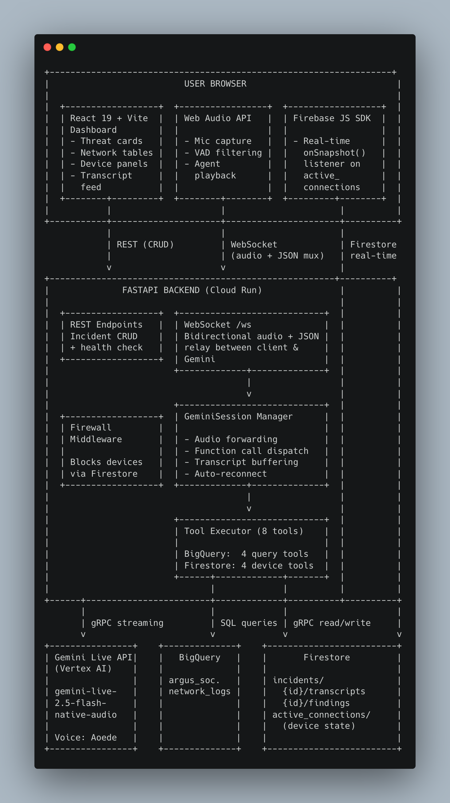

# Project Argus: Voice-Driven SOC Copilot

**Category:** Live Agents (Gemini Live Agent Challenge)

Argus is a real-time, voice-driven Security Operations Center (SOC) AI agent. It enables SOC analysts to interrogate network security logs through natural speech using the Gemini Live API. The agent queries Google BigQuery for threat intelligence, manages device states in Cloud Firestore, and pushes live visual updates to a React dashboard — all in sync with its spoken responses over a single multiplexed WebSocket connection.

## Features

- **Voice-First Interaction** — Speak naturally to query network logs, investigate threats, and issue commands. Supports barge-in (interrupt the agent mid-sentence).
- **Real-Time Threat Intelligence** — Query BigQuery for high-severity threats, filter logs by IP/port/status, and analyze traffic patterns — all via voice.
- **Device Management** — View active network connections in real time, block suspicious devices, and filter connections by status (ACTIVE / BLOCKED / SUSPICIOUS).
- **Incident Tracking** — Each session creates a persistent incident record with full transcripts and tool execution findings, enabling post-session review.
- **Parallel UI Sync** — When the agent executes a tool, results render on the dashboard *before* the agent finishes speaking, keeping the visual and audio experience in lockstep.
- **Live Audio Streaming** — Bidirectional PCM16 audio at 16kHz streamed between the browser and Gemini via WebSocket.

## Tech Stack

| Layer | Technology |
|---|---|
| **AI** | Gemini Live API (`gemini-live-2.5-flash-native-audio`) via `google-genai` SDK |
| **Backend** | FastAPI (Python 3.13), Uvicorn, WebSockets |
| **Frontend** | React 19, Vite, Tailwind CSS, Web Audio API |
| **Analytics DB** | Google BigQuery (`argus_soc.network_logs`) |
| **Operational DB** | Google Cloud Firestore (incidents, transcripts, findings, active connections) |
| **Frontend SDK** | Firebase JS SDK (Firestore real-time listeners) |
| **Hosting** | Google Cloud Run (containerized backend + frontend) |
| **CI/CD** | GitHub Actions + Google Cloud Build + Workload Identity Federation |
| **Container Registry** | Google Artifact Registry |

## Third-Party Data Sources

- **BigQuery `network_logs`** — 1,000+ rows of synthetic network traffic generated by [`scripts/generate_mock_data.py`](argus-incident-responder/scripts/generate_mock_data.py) using Faker. Rows include source/destination IPs, ports, byte counts, and threat intel status (CLEAN / SUSPICIOUS / MALICIOUS).
- **Firestore `active_connections`** — Simulated device connection records created via the `/simulate-traffic` endpoint or seeded manually.

## Architecture Diagram



**High-level flow:**

```
Browser (React + Web Audio API)
    │
    │  WebSocket (audio + JSON)
    ▼
FastAPI Backend (Cloud Run)
    │
    ├──► Gemini Live API (speech ↔ function calling ↔ speech)
    │
    ├──► BigQuery (network log queries)
    │
    └──► Firestore (incidents, transcripts, findings, device state)
    │
    ▼
Firebase JS SDK ◄── Real-time listeners (active connections)
    │
    ▼
React Dashboard (live threat cards, tables, device panels)
```

## Spin-Up Instructions (Local Development)

### Prerequisites

- **Google Cloud Project** with billing enabled
- **gcloud CLI** installed and authenticated (`gcloud auth login`)
- **Python 3.13+**
- **Node.js 22+** and **pnpm** (`corepack enable && corepack prepare pnpm@9 --activate`)
- **uv** package manager (`curl -LsSf https://astral.sh/uv/install.sh | sh`)
- Google Application Default Credentials configured (`gcloud auth application-default login`)

### 1. GCP Setup

```bash
# Set your project
gcloud config set project <YOUR_PROJECT_ID>

# Enable APIs and create BigQuery dataset
cd argus-incident-responder
chmod +x scripts/setup_gcp.sh
./scripts/setup_gcp.sh

# Create the service account for the backend
chmod +x scripts/setup_service_account.sh
./scripts/setup_service_account.sh

# Seed BigQuery with synthetic network log data
uv run scripts/generate_mock_data.py
```

### 2. Start the Backend

```bash
cd argus-incident-responder/backend

# Create a .env file from the example
cp .env.example .env
# Edit .env and set:
#   GOOGLE_CLOUD_PROJECT=<YOUR_PROJECT_ID>
#   GOOGLE_CLOUD_LOCATION=us-central1  (optional, defaults to us-central1)

# Install dependencies and run
uv sync
uv run uvicorn app.main:app --host 0.0.0.0 --port 8000 --reload
```

The backend will be available at `http://localhost:8000`.

### 3. Start the Frontend

```bash
cd argus-incident-responder/frontend

# Create a .env file from the example
cp .env.example .env
# Edit .env and set:
#   VITE_API_URL=http://localhost:8000
#   VITE_FIREBASE_API_KEY=<your Firebase API key>
#   VITE_FIREBASE_AUTH_DOMAIN=<your Firebase auth domain>
#   VITE_FIREBASE_PROJECT_ID=<your GCP project ID>
#   VITE_FIREBASE_APP_ID=<your Firebase app ID>

# Install dependencies and run
pnpm install
pnpm run dev
```

The frontend will be available at `http://localhost:5173`. Grant microphone permissions when prompted.

### Available Scripts

| Directory | Command | Description |
|---|---|---|
| `frontend/` | `pnpm run dev` | Start Vite dev server with hot reload |
| `frontend/` | `pnpm run build` | Production build to `dist/` |
| `frontend/` | `pnpm run preview` | Preview the production build locally |
| `frontend/` | `pnpm run lint` | Run ESLint |
| `backend/` | `uv run uvicorn app.main:app --reload` | Start FastAPI dev server with auto-reload |
| `scripts/` | `./setup_gcp.sh` | Enable GCP APIs and create BigQuery dataset |
| `scripts/` | `uv run generate_mock_data.py` | Seed BigQuery with 1,000 synthetic log rows |
| `scripts/` | `./setup_service_account.sh` | Create backend service account with required IAM roles |
| `scripts/` | `./setup_wif.sh <owner/repo>` | Configure Workload Identity Federation for GitHub Actions CI/CD |

## Proof of Google Cloud Deployment

Both the frontend and backend are containerized and deployed to **Google Cloud Run** via an automated CI/CD pipeline.

- **Deployment pipeline:** GitHub Actions triggers Google Cloud Build on every push to `main`.
  - [`cloudbuild.yaml`](argus-incident-responder/cloudbuild.yaml) — Cloud Build configuration that builds Docker images, pushes them to Artifact Registry, and deploys both services to Cloud Run.
  - [`.github/workflows/deploy.yml`](.github/workflows/deploy.yml) — GitHub Actions workflow that authenticates via Workload Identity Federation and submits the Cloud Build job.
- **GCP services used:**
  - **Cloud Run** — Hosts the FastAPI backend and Nginx-served React frontend as separate services.
  - **Artifact Registry** — Stores container images (`argus-backend`, `argus-frontend`).
  - **BigQuery** — Stores and queries the `argus_soc.network_logs` dataset.
  - **Cloud Firestore** — Real-time operational database for incidents, transcripts, findings, and active device connections.
- **Live Frontend URL:** https://argus-frontend-215980001921.us-central1.run.app
- **Live Backend URL:** https://argus-backend-215980001921.us-central1.run.app
- **Code-level GCP proof (key files):**
  - [`backend/app/gemini.py`](argus-incident-responder/backend/app/gemini.py) — Connects to the Gemini Live API via the `google-genai` SDK (`client.aio.live.connect()`), streams bidirectional audio, and dispatches function calls.
  - [`backend/app/tools.py`](argus-incident-responder/backend/app/tools.py) — Executes parameterized queries against BigQuery (`bigquery.Client`) and writes device state to Cloud Firestore (`firestore.AsyncClient`).
  - [`backend/app/config.py`](argus-incident-responder/backend/app/config.py) — Initializes the Google Cloud BigQuery and Firestore clients used throughout the backend.
  - [`cloudbuild.yaml`](argus-incident-responder/cloudbuild.yaml) — Cloud Build pipeline that builds, pushes to Artifact Registry, and deploys to Cloud Run.
  - [`scripts/setup_gcp.sh`](argus-incident-responder/scripts/setup_gcp.sh) — Enables required GCP APIs and creates the BigQuery dataset.
  - [`scripts/generate_mock_data.py`](argus-incident-responder/scripts/generate_mock_data.py) — Seeds the BigQuery `argus_soc.network_logs` table with synthetic data.

## Demonstration Video

> `[Placeholder — YouTube/Vimeo link to be added]`

## Repository

https://github.com/pratima-sapkota/argus

## Findings and Learnings

- **Gemini Live API native audio** eliminates the need for separate STT/TTS services — the model handles speech-to-speech natively with sub-second latency, including built-in barge-in support.
- **Parallel UI sync is critical for perceived responsiveness.** Sending tool results to both Gemini (for the spoken response) and the WebSocket (for the visual update) simultaneously makes the dashboard feel instantaneous even while the agent is still formulating its verbal answer.
- **A single multiplexed WebSocket** carrying both audio frames and JSON control messages keeps the architecture simple and avoids the complexity of managing multiple connection channels.
- **BigQuery parameterized queries** with `QueryJobConfig` prevent SQL injection while allowing the AI agent to construct flexible filters based on user voice commands.
- **Firestore real-time listeners** on the frontend (via Firebase JS SDK) enable live device status updates without polling, which is essential for the "block device" workflow where the UI must reflect state changes immediately.
- **Cloud Build's multi-step pipeline** (build backend → capture URL → inject into frontend build → deploy) solves the chicken-and-egg problem of the frontend needing the backend's Cloud Run URL at build time.

## License

This project was built for the Gemini Live Agent Challenge hackathon.
