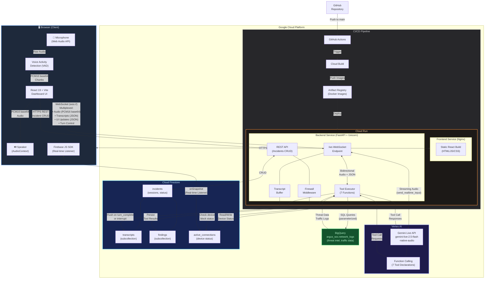

# Project Argus — Architecture Diagram

## Data Flow Summary

| Step | Flow | Protocol | Description |
|------|------|----------|-------------|
| 1 | Browser → Backend | WebSocket | User speaks; PCM16 audio captured via Web Audio API, VAD-gated, sent as base64 chunks |
| 2 | Backend → Gemini | Streaming gRPC | Audio relayed to Gemini Live API via `send_realtime_input()` |
| 3 | Gemini → Backend | Streaming gRPC | Gemini returns audio response + optional function calls |
| 4 | Backend → BigQuery | SQL | If Gemini calls a tool (e.g., `get_high_severity_threats`), parameterized query executes |
| 5 | Backend → Firestore | gRPC | Tool results persisted as findings; transcripts flushed on turn boundaries |
| 6 | Backend → Browser | WebSocket | Audio response + UI update JSON sent simultaneously for parallel rendering |
| 7 | Firestore → Browser | Firebase SDK | Real-time `onSnapshot` listener pushes device status changes directly to UI |

## Tool Function Mapping

| Gemini Tool Call | BigQuery / Firestore | UI Action |
|-----------------|---------------------|-----------|
| `get_high_severity_threats` | BigQuery → MALICIOUS rows | `RENDER_THREATS` |
| `filter_network_logs` | BigQuery → filtered logs | `RENDER_FILTERED_LOGS` |
| `get_traffic_by_port` | BigQuery → port traffic | `RENDER_TRAFFIC` |
| `get_active_connections` | Firestore → all devices | `RENDER_CONNECTIONS` |
| `get_connections_by_status` | Firestore → filtered devices | `RENDER_CONNECTIONS` |
| `get_connection_details` | Firestore → single device | `RENDER_CONNECTIONS` |
| `block_device` | Firestore → set BLOCKED | `DEVICE_BLOCKED` |
